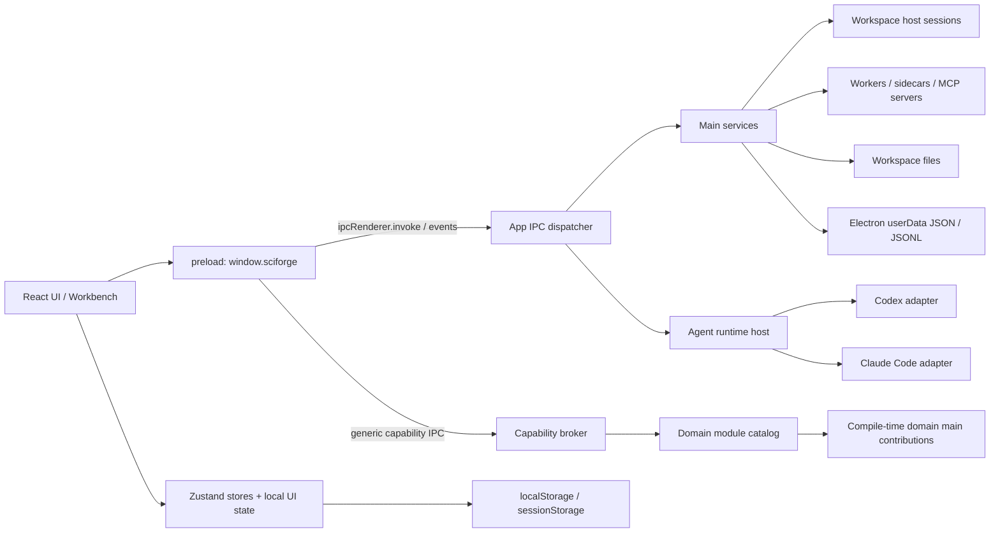
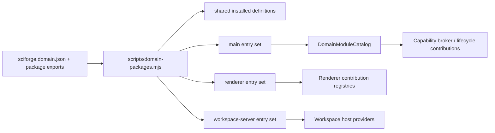

# SciForge 项目架构分析

> **历史审计，不是当前架构规范。** 本文主体是 2026-08-09 的代码快照，保留用于追踪当时的规模、风险和建议；其中 14 个领域包、文件行数、运行时和未完成项均可能已经变化。2026-08-17 当前开发应以根 `AGENTS.md`、`DESIGN.md`、`docs/domain-package-architecture.zh-CN.md`、`CONTEXT-MAP.md`、有效 ADR、当前 OpenSpec 和实际生成式 composition 为准。当前 composition 已包含 25 个领域包；provider-neutral Content Space V1 已归档，OpenContent Change 1 正在实现。

### 2026-08-17 当前 Content Space 架构增量

OpenContent 接入由三个独立所有权单元组成：`content-space` 持有 provider-neutral 引用、能力、确认、Agent 资源范围和 Host 文件传输合同；`opencontent-connector` 持有绑定 UI、节点本地连接、加密 Token、SDK schema 与两阶段 HTTP 传输；`opencontent-content-space-provider` 只持有两者之间的 token-free 映射。Host Core 只提供生成式领域组合、owner-scoped secrets/internal service、Capability Broker 和一次性文件传输，不包含 OpenContent 分支。

Human UI 可全局列出当前绑定账号可见的个人库和团队库，但文件字节只通过 Host picker 句柄进出。Agent 不能调用这些 Human 全局内容能力；Personal Session 必须先由 Human 确认一个当前可枚举的个人库或 Team 根，Broker 再签发与 Agent caller、Principal 和 Workspace 绑定的短期资源。后代只能通过已授权目录的 listing 继续签发，原始 GUID 不能扩大范围。Agent 上传/下载仍需逐次确认，并且只接受当前 Task Workspace 内的相对路径。

> 审计日期：2026-08-09；Identity V1 架构更新：2026-08-14
> 审计模式：Architecture
> 范围：Electron 主进程、preload、React renderer、共享契约、领域包、worker 包、构建与生成脚本
> 方法：静态代码阅读、依赖与入口追踪、边界规则核对；未修改任何产品代码

## Executive Summary

SciForge 是一个以 Electron 为桌面宿主、React 为渲染层、TypeScript 为主要语言的 npm workspace 单仓库。它的核心架构不是简单的“main + renderer”二层结构，而是由四组边界共同组成：Electron 宿主、通用领域 SDK、编译期可信领域包、可独立运行的 worker/sidecar。

当前最成熟的架构能力是领域包组合机制。14 个 `packages/domains/*` 包通过 `sciforge.domain.json` 和显式的 main/renderer/workspace-server 入口声明贡献，`scripts/domain-packages.mjs` 生成各进程组合文件；主进程和 renderer 只消费通用 SDK 合同与生成后的集合，没有发现核心代码按领域 ID 建立中央 feature map。能力调用也有统一的 capability broker，支持发现、绑定、调用、事件和版本协商。

主要架构债务位于宿主内部，而不是领域包内部：主进程组合根、应用 IPC 注册器、agent runtime、Codex runtime、workspace preview host 和 renderer `Workbench` 都已成为数千行级的高耦合模块；此外，主进程和共享层在 49 个 TypeScript 文件中直接导入 `packages/workers/*/src` 私有路径，使 worker 包的公开导出合同没有真正成为边界。运行时签名扩展已经具备签名、完整性、安装、回滚和启停元数据，但可执行入口尚未接入隔离 extension host；它与已激活的编译期领域包是两种不同成熟度的机制。

总体判断：项目的目标架构方向清晰，领域扩展合同也已经落地，但 Electron 宿主和 renderer 工作台仍承载过多领域编排细节。下一阶段应优先收紧 worker 包边界，并把大型组合模块拆成按生命周期和能力聚合的独立单元，而不是增加新的注册表或兼容层。

## Score Dashboard

| 维度 | 分数 | 等级 | 结论 |
|---|---:|:---:|---|
| Maintainability | 6.2 / 10 | B | 边界机制良好，但多个 1,800–4,200 行核心模块显著提高变更半径 |
| Design | 7.4 / 10 | A | 领域包、进程入口、生成组合和 capability broker 的总体设计一致 |
| Security | 未评估 | — | 本次不是安全专项审计，仅记录与架构相关的隔离设计 |
| Stability | 未评估 | — | 未进行运行时故障注入或长时间运行验证 |
| Performance | 未评估 | — | 未进行性能基准或 trace 分析 |
| Testing | 未评估 | — | 仅核对测试结构；本地根依赖不完整，无法执行测试套件 |
| Release | 未评估 | — | 未执行打包、签名或发布流程 |
| **Overall** | **6.8 / 10** | **B** | **架构基础扎实，宿主内部模块化仍需收口** |

## Finding Statistics

| Severity | Count |
|---|---:|
| Critical | 0 |
| High | 0 |
| Medium | 4 |
| Low | 1 |
| Info | 0 |
| **Total** | **5** |

## Project Map

### 1. 项目目录结构

以下目录是生产架构的主要组成部分；`node_modules`、构建产物、缓存、审计资料和临时文件不属于运行时架构。

```text
SciForge_Loop/
├── src/
│   ├── main/                     # Electron main、应用组合、IPC、运行时与宿主服务
│   │   ├── capabilities/         # capability registry、broker、IPC 与核心贡献
│   │   ├── extensions/           # 签名扩展校验、安装仓库、扩展元数据 API
│   │   ├── ipc/                  # 应用级 IPC handler 与 Zod 入参校验
│   │   ├── modules/              # 领域 catalog、生成组合、贡献激活
│   │   ├── processes/            # 受控子进程与 sidecar 管理
│   │   ├── runtime/              # agent-runtime、Codex、Claude Code 适配器
│   │   ├── services/             # 文件、Git、写作、可见上下文、预览等宿主服务
│   │   └── workspace-host/       # 远程/独立 workspace host 会话与传输
│   ├── preload/                  # contextBridge：window.sciforge
│   ├── renderer/src/
│   │   ├── components/           # AppShell、Workbench 及功能 UI
│   │   ├── domain-modules/       # renderer 领域贡献生成集合与注册表
│   │   ├── store/                # 会话/线程主 Zustand store
│   │   ├── plan/                 # GUI plan 状态与 UI
│   │   ├── sdd/                  # SDD 草稿与流程状态
│   │   ├── write/                # 写作工作区、编辑器与预览
│   │   ├── remote-workspace/     # 远程 workspace renderer 协调
│   │   └── lib、hooks、styles…   # 通用 renderer 基础设施
│   └── shared/                   # 跨 main/preload/renderer 的类型、schema 与纯合同
├── packages/
│   ├── domain-sdk/               # 领域包公开合同、进程入口和贡献类型
│   ├── domains/                  # 14 个可独立拥有和版本化的领域包
│   ├── workers/                  # 26 个 worker/sidecar/MCP/独立服务包
│   ├── execution-governance/     # 执行治理合同与实现
│   └── full-trace/               # 全链路 trace 持久化与查询
├── scripts/                      # 领域组合生成、能力治理、打包与架构检查
├── build、release/               # Electron 构建与发布资源
├── electron.vite.config.ts       # main/preload/renderer 构建入口
├── package.json                  # workspace、脚本、Electron 入口
└── tsconfig*.json                # Node 与 renderer 类型边界
```

构建侧由 `electron.vite.config.ts` 为 main 配置主入口和多个 sidecar/MCP 入口，为 preload 生成 CommonJS bundle，为 renderer 提供 Vite/React 构建。renderer 只通过 `@shared` 引用共享合同；生产 Electron 入口为 `out/main/index.js`。

### 2. 总体运行时拓扑



在开发浏览器模式下，`dev-browser-bridge.ts` 提供 loopback HTTP + SSE 适配器，但复用同一 app/capability dispatcher；它是传输替代层，不是第二套业务实现。

### 3. Electron main process 架构

`src/main/index.ts` 是应用组合根。它负责 Electron 生命周期、窗口与托盘、日志与 trace、settings、领域 catalog、capability broker、agent runtime、workspace host、远程通道、更新、通知、IPC 和开发桥的初始化。`app.whenReady()` 中的主要启动顺序如下：

1. 创建 `JsonSettingsStore`、日志和 trace 基础设施。
2. 初始化上下文账本、共享记忆、runtime goals、research cards、visible context 等应用服务。
3. 通过 `createApplicationDomainCatalog()` 合并 4 个 core capability contribution 与生成的领域 main entries。
4. 建立 workspace egress、workspace-host session manager、签名扩展 store。
5. 从 catalog 组合 capability registry/broker，并激活 runtime lifecycle、action guard、artifact consumer 等领域贡献。
6. 初始化 Codex/Claude Code adapter 和统一 `AgentRuntimeHost`。
7. 初始化 schedule、Discord、Zulip、remote channel、workspace preview、更新等宿主功能。
8. 注册应用 IPC 与 capability IPC，开发模式再启动 browser bridge。
9. 创建启用 `contextIsolation: true`、`sandbox: true` 的 `BrowserWindow` 并加载 renderer。

main 的内部层次可概括为：

- **组合层**：`index.ts`、`modules/application-composition.ts`、`modules/catalog.ts`。
- **通信层**：`ipc/register-app-ipc-handlers.ts`、`capabilities/ipc.ts`、`dev-browser-bridge.ts`。
- **应用服务层**：`services/*`，提供 workspace 文件、Git、编辑器、写作、预览、可见上下文等能力。
- **运行时层**：`runtime/agent-runtime/*` 对上提供统一线程/turn/event 合同，对下适配 Codex 与 Claude Code。
- **进程与远程层**：`processes/*`、sidecar 入口、`workspace-host/*`。
- **扩展层**：domain catalog、main contributions、signed extension store。

主进程的依赖注入主要采用显式 options object 和工厂函数，但顶层仍保留多项模块级可变引用，用于 Electron 回调和退出清理。这使 `index.ts` 同时扮演 composition root、service locator 和 lifecycle coordinator。

### 4. Renderer process 架构

renderer 入口 `src/renderer/src/main.tsx` 初始化国际化、开发桥和 settings 监听，然后挂载 `App`。`AppShell` 提供错误边界、懒加载 `Workbench`/Settings，并在路由切换时保留工作台实例。

renderer 的实际中心是 `Workbench.tsx`：它组合聊天时间线、composer、workspace explorer、写作工作区、右侧面板、底部面板、全局 overlay、工具栏、命令和领域贡献。领域 UI 没有通过 switch/domain-ID 硬编码到核心，而是通过 `installedRendererContributions` 按贡献类型注册和解析：

- `command`
- `toolbar-action`
- `right-panel`
- `bottom-panel`
- `global-overlay`
- `composer-context-provider`
- `i18n-bundle`
- `workspace-preview`
- `runtime-lifecycle`

`installed-domain-renderer.ts` 是生成文件，为所有 renderer domain entries 提供同一个 `DomainRendererHost`。该 host 只暴露 capability invoker、安全外链、workspace 选择/远程连接、导航和 visible-context 等通用合同。

UI 代码按 chat、plan、SDD、write、remote-workspace、workspace-preview 等功能目录组织，但顶层交互编排仍集中在 `Workbench` 和 chat store。这是当前 renderer 的主要模块边界压力点。

### 5. IPC 通信方式

生产 Electron 使用单一 preload facade：`contextBridge.exposeInMainWorld('sciforge', api)`。renderer 不直接导入 Electron API，而是调用类型化的 `window.sciforge`。

通信有三类：

| 类型 | 机制 | 用途 |
|---|---|---|
| 请求/响应 | `ipcRenderer.invoke` → `ipcMain.handle` | settings、文件、Git、runtime、扩展、写作、更新等 |
| 主进程推送 | `webContents.send` → preload listener | runtime event/end/error、settings changed、workspace changed、远程状态、更新状态 |
| 通用能力总线 | `capability:*` 9 个固定 channel | readiness、discover、observe、bind、invoke、events、订阅 |

应用级 IPC 集中注册在 `register-app-ipc-handlers.ts`。`handleInvoke()` 统一验证 sender、记录指标并调用 handler；payload 使用 Zod schema 解析。主窗口还校验 sender/frame URL。preload 中约有 143 处 `ipcRenderer.invoke`，应用注册器约有 135 个 `handleInvoke` 调用点，其中包括包装器自身；二者通过共享 API 类型和 schema 保持一致，但普通应用 channel 的名称和映射仍分布在 preload、handler、shared 类型/schema 多处。

capability IPC 的结构更集中：channel 常量、版本协商、broker 调用和事件订阅在 `src/main/capabilities/ipc.ts` 形成单一通用协议。领域功能原则上应优先通过这一协议暴露，而不是新增领域专用 IPC。

### 6. 状态管理方案

renderer 采用“Zustand + React 局部状态 + 主进程权威状态”的混合模型：

| 状态域 | 主要实现 | 权威来源/持久性 |
|---|---|---|
| 聊天、线程、turn、时间线、导航、remote channel 投影 | `store/chat-store.ts` 及 action modules | runtime/main 为事实来源；renderer 为可交互投影 |
| 写作工作区 | `write/write-workspace-store.ts` | workspace 文件为事实来源；store 管理编辑状态、保存调度 |
| GUI plan | `plan/plan-store.ts` | renderer 运行态，接收 runtime/IPC 更新 |
| SDD 草稿 | `sdd/sdd-draft-store.ts` | Zustand + localStorage 恢复 |
| 领域自有 UI 状态 | 例如 anchored-comments store | 归领域 renderer 包所有 |
| settings | `RendererRuntimeClient` 缓存 + `settings:changed` | main `JsonSettingsStore` 为权威来源 |
| 组件短生命周期状态 | React hooks/context | 不持久化 |

`ChatState` 是 renderer 最大的状态边界，包含路由、runtime、workspace、线程、消息块、side conversation、remote channel 以及大量 action。实现通过多个 action factory 拆分行为，而不是把所有 reducer 写在一个函数中；但是公开 store contract 仍覆盖多个业务域。

状态所有权的总体规则是合理的：workspace 内容归文件系统，runtime 会话归 main/runtime store，renderer 主要保存 UI 投影和恢复提示。需要继续避免把持久业务事实复制进 localStorage 或多个 Zustand store。

### 7. 数据持久化方式

项目没有一个全局数据库；持久化按数据所有者分层。

#### Electron userData

主进程通过 Electron `app.getPath('userData')` 保存应用级数据：

- `sciforge-settings.json`：`JsonSettingsStore`，带规范化/迁移、损坏文件备份和原子替换。
- `runtime-context-ledgers/ledgers.json`、`shared-memory/memories.json`、`runtime-goals/goals.json`、`research-cards/cards.json`：各服务的 JSON snapshot。
- `visible-context/snapshot.json` 及 capture 文件：当前可见上下文与图像。
- `codex-runtime/threads.json`、`codex-runtime/events/*.jsonl`、usage JSONL：Codex 线程、事件和用量。
- `claude-code-runtime/*`：Claude Code 线程、事件及 SDK session 项目数据。
- `extensions/registry.json`、`extensions/packages/*`：签名扩展注册表和版本化 payload。
- full-trace、日志、远程通道状态等各自拥有的数据目录。

`services/app-data-store.ts` 提供受根目录约束的路径解析、no-follow/realpath 检查、原子 JSON/text 写入和 `AppDataJsonlStore`，用于减少路径逃逸与部分写入风险。

#### Workspace 文件

研究资料、写作文档、生成物、领域项目数据和部分远程通道配置以 workspace 文件为权威来源。文件访问统一经过 main/workspace host 服务和 workspace 路径校验；远程 workspace 通过 `WorkspaceHostSessionManager` 的窄接口执行。

#### Browser storage

localStorage 仅承担 renderer 恢复与偏好类数据，例如活动线程与排队消息的有界恢复快照、SDD draft registry/content、线程/分支关系、composer 输入记忆、写作/预览偏好和部分科学标注。sessionStorage 用于开发桥或 visible-context revision 等会话级数据。

#### 领域专用存储

领域或 worker 可以选择适合自身的数据存储。Identity V1 的唯一权威账户库由 `packages/domains/identity-access` 拥有，位于 `<userData>/identity-access/identity.sqlite`，使用 `node:sqlite`、事务迁移和 `PRAGMA user_version`；宿主和 renderer 都不直接访问该数据库。其他示例包括 paper-radar worker 的 SQLite。以上都不是应用核心的统一数据库，也不应被宿主直接当作共享数据层。

### 8. 插件/能力扩展机制

当前需要区分三种扩展层：

#### A. 编译期可信领域包（已完整运行）

14 个 `packages/domains/*` 包是领域所有权、版本、安装和发布的单位。每个包使用 `sciforge.domain.json` 描述 package/module、host API 兼容范围、进程入口和贡献；`package.json` 为 definition/main/renderer/workspace-server 提供显式 exports。



生成文件共有四个：

- `src/shared/installed-domain-packages.ts`
- `src/main/modules/installed-domain-main.ts`
- `src/renderer/src/domain-modules/installed-domain-renderer.ts`
- `packages/workers/workspace-host/src/generated/installed-domain-workspace-server.ts`

main 支持 capability factory、Principal provider、runtime lifecycle、agent artifact consumer、action guard、workspace preview plugin、workspace-host provider 等贡献；renderer 支持命令、面板、session overlay、application overlay、toolbar widget、composer context、i18n、preview 和 lifecycle。新增/删除领域包由 manifest 与生成流程完成，不需要编辑核心领域 ID 映射。

#### B. Capability broker（已完整运行）

能力通过通用 registry/broker 注册，调用者执行 readiness/discover/observe/bind/invoke，而不是了解具体领域服务。合同包含版本、scope、effect/approval、资源句柄/revision 和事件订阅。`scripts/capability-governance.mjs` 用于检查能力清单、生成物和禁止的直接传输路径。

Identity V1 的账户查询、列举、创建、选择、重命名、退出、首启提示关闭和故障恢复全部走这条路径。账户能力只面向经过共享 trusted-renderer sender policy 校验的 Human UI；没有 Identity 专用 IPC、preload API、MCP surface 或 Agent 工具入口。

#### Identity V1 的 Principal 与 UI 路径

`packages/domains/identity-access` 通过 manifest 同时贡献一个 package-owned capability factory、唯一 Principal provider、application overlay、Workbench toolbar widget、renderer lifecycle 和 i18n 资源。main 与 renderer 使用该包的独立显式入口，Identity 只经 generated composition 进入运行时。

主进程的通用 Principal context 从领域 catalog 解析零个或一个 provider；多个 provider 会被拒绝。trusted sender 校验完成后，Host 把只含 `userId`、`deviceId`、`assurance` 和 `identityVersion` 的不可变快照注入 capability caller。V1 provider 只产生 `local-selection` assurance；renderer、Agent、能力输入和其他领域都不能声明或提升 Principal。

Agent runtime 在公开 `startTurn` 边界读取一次当前 Principal，并把快照固化到 adapter context、持久化事件、tool/capability context、trace 和完成 artifact。账户切换、重命名、退出或 Identity 故障只影响后续 turn，不会重新绑定运行中的 turn。

renderer 通过通用 application-overlay registry 和 Workbench toolbar-widget registry 装载 Identity UI；`AppShell` 与 `WorkbenchTopBar` 不导入 Identity 代码，也不读取账户状态。Local Account 只是本机归属标识，不是安全认证或本地数据 tenant；退出和切换不会隔离、移动或重新归属 Workspace、聊天、设置、API Key 或工具数据。

#### C. 运行时签名扩展（安装层已完成，执行层待完成）

`SignedExtensionStore` 验证官方 Ed25519 签名、artifact 完整性、host API、权限和入口元数据，并提供安装、卸载、回滚、启停和版本 registry。当前 `createDomainExtensionsApi` 明确只暴露有界元数据；可执行入口仍留在 store 中，等待未来 isolated extension host。因此“已安装运行时扩展”目前不会自动进入 main catalog、renderer contribution registry 或 workspace-server 组合。

#### D. Worker/sidecar 扩展

26 个 `packages/workers/*` 包承载 MCP server、独立进程、模型路由、搜索、绘图、计划、workspace 分析等基础设施。它们通常由 main 的受控进程或 workspace host 启动。概念上 worker 是独立部署/执行单元，领域包是用户功能所有权单元；当前实现中这两类边界尚未完全隔离，因为宿主存在大量 worker 私有源码导入。

### 9. 当前模块边界

| 边界 | 当前合同 | 评价 |
|---|---|---|
| renderer → preload | `window.sciforge` / `SciForgeApi` | 清晰；renderer 不直接访问 Electron |
| preload → main | invoke/event IPC + Zod payload | 运行路径统一，普通 channel 定义仍较分散 |
| host → domain | `@sciforge/domain-sdk` host contracts | 清晰，未发现领域包导入 host-private 路径 |
| domain → capability | generic capability invoker/broker | 清晰，避免领域专用核心 IPC |
| domain discovery | manifest + generated composition | 清晰，无中央 domain-ID feature map |
| main → runtime | `AgentRuntimeHost` + Codex/Claude adapters | 合同明确，内部实现体积过大 |
| main → workspace host | session manager narrow port | 清晰，支持本地/远程 placement |
| host/shared → workers | 包公开 exports 与私有 `src` 深导入并存 | 边界未收口，是最明确的依赖方向问题 |
| runtime extension → host | 签名 store/metadata API | 安装合同清晰，执行 host 尚未落地 |
| renderer feature boundaries | 目录 + store action modules + contribution slots | 功能目录存在，但顶层 orchestration 过度集中 |

## Coverage Matrix

| 区域 | 检查内容 | 覆盖状态 | 主要证据/限制 |
|---|---|---|---|
| 根目录与构建配置 | workspace、Electron/Vite 入口、tsconfig、脚本 | 已检查 | `package.json`、`electron.vite.config.ts`、`tsconfig*.json` |
| Electron main | 启动、窗口、生命周期、runtime、服务、退出 | 已检查 | `src/main/index.ts` 及 main 子目录入口 |
| Preload/IPC | facade、invoke/event、sender 校验、schema、dev bridge | 已检查 | `src/preload/index.ts`、main IPC/capability IPC |
| Renderer | AppShell、Workbench、贡献注册、主要功能目录 | 已检查 | renderer 入口、Workbench、domain registries |
| 状态管理 | Zustand stores、runtime client、local/session storage | 已检查 | chat/write/plan/SDD stores 与 persistence helpers |
| 数据持久化 | settings、JSON/JSONL、runtime stores、workspace、SQLite | 已检查 | main services/runtime、领域 worker |
| 领域扩展 | 14 个 manifest、SDK、生成组合、贡献类型 | 已检查 | domain-sdk、domains、generator、catalog |
| Worker 边界 | 26 个 worker 包、公开 exports、宿主导入路径 | 已检查 | package manifests 与跨包 import 扫描 |
| 运行时签名扩展 | verify/store/API/激活路径 | 已检查 | `src/main/extensions/*`、main composition |
| 运行测试 | domain/capability check、focused Vitest | 受阻 | 根依赖缺少 `tsx` 和 `vitest`，未安装依赖以保持只读范围 |
| 打包运行 | source/packaged Electron smoke | 未执行 | 本次为只读架构分析，且依赖环境不完整 |

## Top Risks

1. **Worker 私有源码导入破坏包边界**：任一 worker 内部重排都可能跨包破坏 main/shared，且现有边界测试只覆盖部分迁移文件。
2. **主进程组合根与 IPC 注册器变更半径过大**：新增一个跨切面功能容易同时触碰启动、全局引用、handler 和退出清理。
3. **Renderer 顶层编排集中**：`Workbench` 与 `ChatState` 同时承担多个功能域，领域贡献机制尚未完全降低核心 UI 的认知负荷。
4. **IPC 普通 channel 缺少单一声明源**：preload、handler、共享类型/schema 之间依靠人工同步，规模已超过百个 channel。
5. **运行时扩展的“安装”与“激活”语义不同**：若产品层未显式区分，用户可能将已安装/已启用理解为功能已经加载。

## Detailed Findings

### Finding: Host/shared 绕过 worker 包公开入口

- Severity: Medium
- Confidence: High
- Category: Architecture
- Status: Confirmed
- Subtype: Dependency Direction / Module Boundary
- Affected area: `src/main/**`、`src/shared/**` 与 `packages/workers/*`
- Evidence:
  - 跨包扫描发现 49 个 main/shared TypeScript 文件引用 `packages/workers/*/src` 私有路径。
  - `src/main/index.ts:101` 直接导入 `packages/workers/workspace-intel/src/visual-inspection`。
  - `src/main/ipc/register-app-ipc-handlers.ts:167-179` 直接导入 scientific-plotting 的 engine、index、installer 和 extractor 内部文件。
  - `src/shared/scientific-plotting.ts:1-2` 与 `src/shared/write-retrieval.ts:5` 把 worker 私有类型再导出到共享层。
  - `src/main/domain-module-boundaries.test.ts:165-168` 的私有 worker 导入检查只覆盖列出的 migrated files，未覆盖整个 `src/main`/`src/shared`。
- Problem: worker package 是 workspace 的所有权与发布单元，但宿主依赖其源码布局而非 package exports，公开合同与实际依赖图不一致。
- Why it matters: worker 无法在不协调宿主的情况下重构目录、调整构建产物或独立版本化；shared 层还会把基础设施实现细节传播到 renderer 类型图。
- Realistic failure scenario: scientific-plotting 将 `src/types.ts` 拆分并保持公开 export 不变，worker 自身测试通过，但 Electron 主构建和 shared 类型检查同时失败。
- Minimal fix: 为所有实际消费的 contract/service/entrypoint 增加明确 package subpath export，并把 main/shared 导入逐项改为 `@sciforge/<worker>/<subpath>`；删除不再需要的深路径桥接。
- Better long-term fix: 将 worker 的 contract 与 executable entrypoint 作为受版本约束的公开 API；添加全仓边界规则，禁止任何包外 `packages/*/src` 导入，仅生成组合文件允许显式例外。
- Regression test suggestion: 扫描所有生产 TypeScript 文件，断言跨 package import 只能命中目标包 `exports` 中声明的根或 subpath；再运行 source 与 packaged main 构建。
- Estimated effort: Medium（约 2–5 天，取决于 26 个 worker 的 export 整理范围）

### Finding: Main composition root 同时承担过多生命周期职责

- Severity: Medium
- Confidence: High
- Category: Architecture
- Status: Confirmed
- Subtype: Single Responsibility / Coupling
- Affected area: `src/main/index.ts`、`src/main/ipc/register-app-ipc-handlers.ts` 及 runtime/service 初始化
- Evidence:
  - `src/main/index.ts` 为 1,891 行，`app.whenReady()` 从 `src/main/index.ts:1048` 延伸到大部分余下启动逻辑。
  - `src/main/index.ts:405-431` 维护窗口、settings、runtime、remote channel、workspace host、tray 和多个生命周期标志等模块级可变状态。
  - `src/main/ipc/register-app-ipc-handlers.ts` 为 1,912 行，并通过大型 options object 注入绝大多数应用服务。
  - 高复杂度依赖还汇聚到 `runtime/agent-runtime/host.ts`（4,064 行）、`runtime/codex/codex-service.ts`（4,275 行）和 `services/workspace-preview/host.ts`（3,423 行）。
- Problem: composition root 不只负责装配，还直接管理多个子系统启动顺序、状态引用、IPC 注入和清理；子系统缺少一致的 activate/dispose 边界。
- Why it matters: 修改一个子系统的启动或退出语义时，需要理解全局顺序和多个可变引用，容易形成半初始化、重复清理或遗漏事件解绑。
- Realistic failure scenario: 新增一个依赖 workspace-host 和 capability broker 的服务，在启动中段失败；前置 sidecar 已启动但对应 dispose 尚未登记，应用重试或退出时留下孤儿进程。
- Minimal fix: 按现有责任域提取 `createXSubsystem(dependencies) -> { service, dispose }` 工厂，组合根只保存一个按逆序释放的 disposer 列表；保持现有 canonical 服务和 IPC 路径不变。
- Better long-term fix: 建立少量明确的宿主模块（runtime、workspace、communications、updates、extensions），每个模块拥有公开 port、启动事务和幂等 dispose；`index.ts` 仅处理 Electron 生命周期和模块装配。
- Regression test suggestion: 为每个子系统加入启动失败回滚、重复 dispose 和 Electron quit 顺序测试，并对 composition root 设置依赖方向与体积预算。
- Estimated effort: Large（分阶段 1–3 周）

### Finding: Renderer 顶层工作台和聊天状态跨越多个功能边界

- Severity: Medium
- Confidence: High
- Category: Architecture
- Status: Confirmed
- Subtype: Frontend State / Module Boundary
- Affected area: `src/renderer/src/components/Workbench.tsx`、`src/renderer/src/store/chat-store-types.ts`、相关 action modules
- Evidence:
  - `Workbench.tsx` 为 3,398 行，既解析领域面板/命令贡献，也编排 chat、composer、workspace、write、plan、SDD、remote workspace 和 overlay。
  - `src/renderer/src/components/Workbench.tsx:841-1095` 同时获取并解析 toolbar、right-panel、bottom-panel、global-overlay 多类 registry。
  - `ChatState` 位于 `chat-store-types.ts:213-423`，公开合同包含路由、runtime、workspace、线程、blocks、side conversations、remote channels 与跨域 actions。
  - chat store 已把实现拆成 action factories，但所有 action 最终仍组合进一个全局 store。
- Problem: renderer 已有领域 slot 和功能目录，但核心工作台与全局 store 仍是多个功能域的共同编排点，模块边界没有延伸到状态 ownership 和 UI controller。
- Why it matters: 新增一个面板或工作流可能触发工作台、全局 store、恢复逻辑和 runtime 订阅的联动修改，测试难以局部化。
- Realistic failure scenario: remote-workspace 增加重连状态并复用线程切换逻辑，导致本地线程导航 action 同时被修改，最终在 workspace 切换时错误保留 composer/side-conversation 投影。
- Minimal fix: 先提取无新抽象的 feature controllers/hooks（如 workspace session、panel layout、runtime timeline），让 `Workbench` 仅组合；以 selector facade 限制组件读取完整 `ChatState`。
- Better long-term fix: 将 chat/runtime、workspace、write、plan/SDD 和 shell layout 划分为独立 renderer modules，各自拥有 store slice 或外部 store；跨域操作通过少量应用级 commands/events 协调，领域 UI 继续走现有 contribution registry。
- Regression test suggestion: 为 workspace 切换、线程切换、remote reconnect 和面板 contribution 建立独立集成测试，并断言无关 slice 不发生变化。
- Estimated effort: Large（分阶段 2–4 周）

### Finding: 普通应用 IPC 合同没有单一声明源

- Severity: Medium
- Confidence: High
- Category: Architecture
- Status: Confirmed
- Subtype: Boundary Contract / Evolution Risk
- Affected area: `src/preload/index.ts`、`src/main/ipc/register-app-ipc-handlers.ts`、共享 API 类型与 schema
- Evidence:
  - preload 中约有 143 个 `ipcRenderer.invoke` 调用点，应用 handler 注册器中约有 135 个 `handleInvoke` 调用点。
  - channel 字符串分别写在 preload 与 main handler 中；入参 schema、返回类型和 renderer API shape 位于其他 shared 文件。
  - `src/main/capabilities/ipc.ts:24-33` 的 capability channel 已采用集中常量与统一 broker 协议，普通 app IPC 尚未采用等价的声明模型。
  - 开发 browser bridge 复用 dispatcher，避免了业务实现重复，但仍需维护允许 channel 和 browser facade 映射。
- Problem: 同一 IPC endpoint 的名称、输入、输出和 facade 实现分散，编译器无法从一个定义生成或验证所有边界。
- Why it matters: channel 数量已超过百个，新增或重命名 endpoint 时容易出现 preload 存在但 main 未注册、schema 与类型漂移、开发桥遗漏等问题。
- Realistic failure scenario: 一个文件操作 endpoint 增加可选字段，只更新 preload 类型和 main handler，但忘记 browser bridge/schema；Electron 正常，开发浏览器模式在运行时拒绝 payload。
- Minimal fix: 为普通 app IPC 建立只包含 channel、input schema、output type 的 declarative contract map，并由现有 handler/preload wrapper 消费；不要增加第二个 dispatcher。
- Better long-term fix: 从 contract map 生成/类型推导 preload client、main registration 辅助类型和 dev bridge allowlist，使 Electron 与 browser transport 共享一个协议定义和同一 handler 表。
- Regression test suggestion: 自动枚举 contract map，验证 preload 暴露、main handler、dev bridge 和 schema 全部一一对应；保留未知 channel 拒绝测试。
- Estimated effort: Medium（约 3–7 天，可按 endpoint 分批迁移）

### Finding: 运行时扩展的安装状态尚不等于执行激活

- Severity: Low
- Confidence: High
- Category: Architecture
- Status: Confirmed
- Subtype: Boundary Contract / Product Semantics
- Affected area: `src/main/extensions/*`、领域 catalog、renderer extension UI
- Evidence:
  - `src/main/extensions/store.ts:35-69` 定义 extensions store、`sandboxed-runtime` metadata 和 `extension-host` isolation 声明。
  - `src/main/extensions/domain-extensions-api.ts:25-26` 明确说明 API 只暴露有界元数据，可执行入口等待未来 isolated hosts。
  - `src/main/index.ts:1206` 创建 `SignedExtensionStore`，但 `createApplicationDomainCatalog()` 在此之前只组合 core 和编译期生成 entries。
  - 未发现安装/启用后把 runtime package entrypoint 注入 main catalog、renderer registry 或 workspace-server host 的激活路径。
- Problem: store 可以把扩展标记为 installed/enabled/active version，但当前运行时没有与这些状态对应的 executable activation contract。
- Why it matters: 架构内部语义是“已验证并暂存”，产品或调用方却可能把 enabled 理解为能力已可用；未来直接把代码加载进主进程还会绕开已声明的隔离模型。
- Realistic failure scenario: 用户安装并启用一个声明 renderer/main entrypoint 的扩展，扩展列表显示 active，但 capability discovery 和 UI contribution 均没有变化。
- Minimal fix: 在执行 host 落地前，把外部状态和 UI 文案明确为 installed/staged，并让 readiness 返回“不支持运行时激活”的机器可读原因。
- Better long-term fix: 实现独立 extension-host 进程与 sandboxed renderer surface，通过 capability broker 和序列化 contribution descriptors 接入；不要将第三方入口直接 import 到 main/renderer。
- Regression test suggestion: 安装 fixture 后验证状态语义；执行 host 落地后，再验证启用/禁用会原子地注册/撤销 capability 和 renderer contribution，并在崩溃时隔离宿主。
- Estimated effort: Small（语义澄清 1–2 天）；Large（完整隔离执行 host 数周）

## Architecture

### 依赖方向

目标依赖方向应为：Electron host → 通用 SDK/ports ← domain packages；host → worker public contracts；renderer → preload facade → main。领域包当前基本遵守这一方向，主要偏差是 host/shared 对 worker 私有源码的反向渗透。

### 组合与发现

编译期领域组合采用 manifest 驱动生成，而不是手写中央注册表，符合“安装一个包不修改核心 feature map”的目标。core capability 仍以 4 个通用 synthetic domain entries 进入同一 catalog，从而避免第二套 capability registry。

### 单一规范路径

- 领域能力：capability broker 是规范路径。
- workspace preview：main host + placement router + workspace-host provider 是规范路径。
- runtime 操作：`AgentRuntimeHost` 是 renderer IPC 的统一入口。
- 外部写入：renderer 经 preload/main service 或 capability broker，不直接写本地系统。
- 开发浏览器：替换 transport，但复用 dispatcher，未复制业务实现。

当前最需要防止的是新增领域专用 IPC、旁路 capability broker，或为 runtime extensions 建立直接 main import 的兼容路径。

## Maintainability

维护性优势包括严格 TypeScript、Zod 边界校验、显式 package exports、生成文件 freshness 脚本、领域边界测试、service options 注入和较丰富的 focused tests。维护性风险主要来自数千行 orchestrator、普通 IPC 人工同步、worker 私有导入和多个 renderer 全局状态域。

大型文件本身不是缺陷；本报告将其列为 finding，是因为这些文件同时跨越多个独立生命周期或所有权边界。拆分时应围绕现有能力/生命周期合同进行，不应仅按行数切成更多无语义 helper。

## Design

设计上最值得保留的是“domain package = ownership/version/release unit”和 process-specific entrypoints。`DomainMainHost`/`DomainRendererHost`/`DomainWorkspaceServerHost` 将宿主能力限制为通用合同，生成组合保证 source 与 packaged path 有统一入口。

两个需要明确命名的不同概念是：

- **trusted compile-time domain package**：随应用构建，贡献会在启动时进入 catalog/registry。
- **signed runtime extension package**：运行时验证和保存，目前尚未执行。

后续设计不应通过兼容别名把两者伪装为同一种加载方式；应让 runtime extension 通过隔离 host 适配到现有 capability/contribution contracts。

## Principles Compliance

| 原则 | 状态 | 说明 |
|---|---|---|
| 领域包是独立所有权与版本单位 | 符合 | 14 个 domain package 均有 manifest 与 package exports |
| main/renderer 使用独立显式入口 | 符合 | 生成 main/renderer/workspace-server entry sets |
| 通过 manifest + generated composition 发现 | 符合 | 无需维护核心 domain-ID map |
| domain 不导入 host-private 实现 | 符合 | 静态扫描未发现此类导入 |
| host 只依赖通用 SDK/extension points | 基本符合 | 对 domain 符合；对 worker 仍有私有源码深导入 |
| 每项能力只有一条规范路径 | 基本符合 | capability/runtime/preview 路径统一；普通 IPC 合同定义分散但 handler 路径单一 |
| 不使用兼容层维持旧架构 | 未发现明显违例 | 开发桥复用 dispatcher，不是业务 fallback |
| 行为应一般化、无领域硬编码 | 符合 | 核心未发现当前领域 ID 的 switch/feature map |
| 文档与测试描述最终设计 | 部分符合 | 架构测试方向正确，但 worker 私有导入检查覆盖范围不足 |

## Recommended Fix Order

1. **收紧 worker package 边界**：先建立缺失的 public subpath exports，再替换 49 个生产文件中的私有源码导入，同时扩大边界测试范围。
2. **建立普通 IPC contract map**：先覆盖新增 endpoint，再逐批迁移既有 channel；保持现有 dispatcher 是唯一实现。
3. **拆分 main 生命周期单元**：从依赖最清晰的 communications、updates、workspace-host 或 extensions 子系统开始，引入统一 disposer contract。
4. **降低 Workbench/ChatState 认知负荷**：先提取 feature controller 和 selector facade，再决定是否拆分 store；不要一次性重写 renderer 状态。
5. **明确 runtime extension 路线**：短期校正文案和 readiness 语义，长期单独设计隔离 extension host。

## Quick Wins

- 将边界测试的 worker 深导入扫描从少量 migrated files 扩展到整个 `src/main`、`src/shared` 和非生成 renderer 代码。
- 为所有新增 IPC endpoint 强制使用集中 channel 常量，并添加 preload/main/dev bridge parity 测试。
- 给 `index.ts` 的每个已启动子系统立即登记 disposer，减少退出路径遗漏。
- 为 `Workbench` 增加按 feature 的 selector hooks，阻止新组件直接订阅完整 `ChatState`。
- 在扩展列表中区分 `installed/staged` 与 `runtime-active`，直到 isolated host 真正存在。

## Long-term Refactor Plan

### Phase 1：边界收口

- 清理 worker 私有导入并补齐 exports。
- 将 package boundary、generated composition freshness、capability governance 合并为持续集成必过项。
- 明确每类持久化数据的 owner、root 和 schema version。

### Phase 2：宿主生命周期模块化

- 把 runtime、workspace、communications、extensions、updates 分别封装为可启动/可释放模块。
- 让 IPC handler 依赖窄 port，而不是注入大型 service collection。
- 对 source 与 packaged application 使用同一 composition contract 做 smoke 验证。

### Phase 3：Renderer 应用层模块化

- 将 shell layout、runtime timeline、workspace session、write、plan/SDD 拆成独立 controller/store ownership。
- 保留现有 renderer contribution registry 作为领域 UI 的唯一扩展入口。
- 建立跨 feature command/event，而不是直接互相写 store。

### Phase 4：隔离运行时扩展

- 定义 extension-host 进程协议、资源限制、崩溃恢复和权限绑定。
- 只允许扩展通过 capability broker 与序列化 UI contribution 描述符接入。
- 验证安装、升级、回滚、启停和 host API 不兼容时的原子行为。

## Verification Notes

本次尝试执行：

- `npm run domain-packages:check`
- `npm run capability:check`
- focused Vitest：domain boundaries、application composition、renderer contributions

这些命令未进入项目检查逻辑：当前工作区根依赖缺少 `tsx`，且 `vitest` 命令不可用。为遵守“只分析、不修改代码”的范围，本次没有安装依赖、没有刷新生成文件，也没有执行打包。所有结论均基于已提交/现存源码与生成文件的静态证据；在依赖恢复后，应优先重跑上述检查以及 source/packaged Electron smoke tests。
