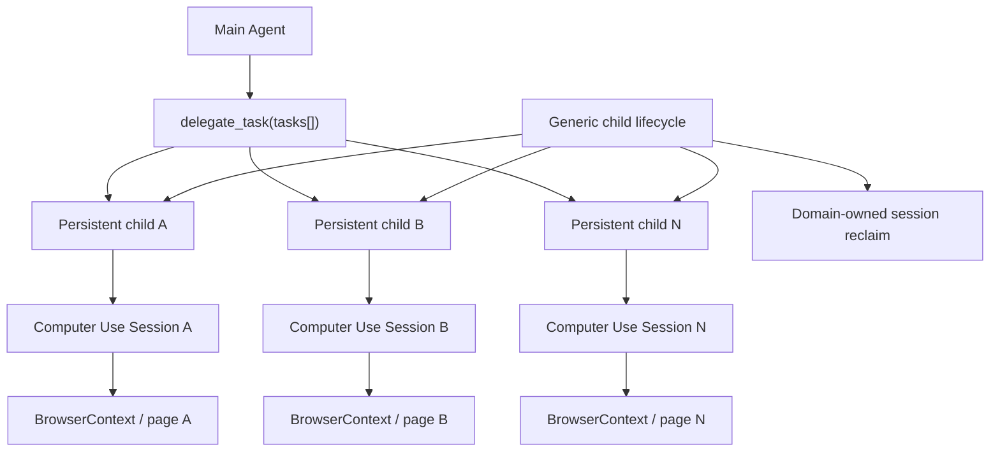

# Persistent sub-agent multi-target CDP architecture and validation

## 1. Background and goal

This stacked change lets one Main Agent delegate page work to multiple persistent child agents. Each child uses the existing managed Computer Use contract with its own session, BrowserContext/page target, lifecycle, approval ownership, and cleanup. The goal is real concurrent page execution with bounded failure isolation, not a second Computer Use scheduler.

## 2. Why reuse persistent sub-agents

Persistent children already provide durable identity, provider-owned threads, transcript continuity, status/wait/message/cancel operations, tool governance, and lifecycle control. Reusing that runtime keeps planning and reasoning inside ordinary agents and avoids a Computer Use-specific agent abstraction.

## 3. Why there is no `runEphemeral` or Computer Use `parallel[]`

An ephemeral runner or a `parallel[]` action would create another lifecycle and ownership authority beside the existing multi-agent runtime. This design instead performs one `delegate_task(tasks[])`; every child independently discovers and invokes the same five managed MCP tools. The Computer Use service remains session-oriented and does not become an agent scheduler.

## 4. Final architecture

Child identity is carried through `childId`, provider thread/turn, approval ID/call ID, and Computer Use session ownership. There is no alias-only routing decision.

## 5. Generic approval and runtime fixes

The shared runtime changes apply to every persistent child:

- approval aliases resolve through the exact owner thread and request;
- multiple children may hold approvals for the same provider/tool alias without collision;
- a newly attached child surface receives the current pending approval snapshot;
- Allow/Deny and repeated activation consume one resolver exactly once;
- approval wait suspends the child's active execution deadline through independent tokens;
- parent abort remains immediate while the deadline is suspended;
- terminal child lifecycle events carry child and parent ownership;
- inactive or newer parent turns ignore late child receipt projection without aborting the child;
- read-only diagnostics expose redacted active lifecycle counters.

These changes contain no Computer Use package ID, tool name, or approval bypass.

## 6. Child tool governance

The Main Agent delegates through the normal multi-agent tool. Child tools are constrained by the runtime allowlist and the capability broker. Managed MCP calls retain their ordinary schema validation, effect classification, approval, trusted invocation proof, and audit events. A child cannot acquire a broader Computer Use scope merely because it was delegated.

## 7. Active-time deadline

The child execution deadline measures active execution. Host-managed human approval wait is suspended with an approval-specific token and resumes only after that exact approval resolves. Multiple pending tokens are independent. Cancellation and parent abort are not suspended, preventing approval wait from becoming an unbounded cancellation shield.

## 8. Parent and exact-child cancellation

Parent cancellation propagates through active delegation requests, lifecycle controls, execution boundaries, managed MCP, SessionInputChannel, and the CDP adapter. `subagent_cancel(childId)` addresses one exact child. It closes that child's pending approval fail closed and reclaims its resources without cancelling siblings.

## 9. Child terminal to Session reclaim

The generic runtime publishes `after-persistent-child-turn` for completed, failed, and cancelled children. The Computer Use domain consumes that generic event and reclaims sessions owned by the exact child provider thread/turn. Computer Use does not add another child registry, cancel controller, or lifecycle implementation.

## 10. Eight-child real product evidence

The accepted product batch used the SciForge renderer and normal Host approvals:

- one `delegate_task(tasks[8])` call;
- eight persistent children;
- eight independent Computer Use sessions;
- eight independent BrowserContext/page targets;
- eight structured action sequences with verification/readback matched;
- exactly one commit per target;
- `replayed=false` for every target;
- all eight sessions released or reclaimed successfully.

Measured CDP action intervals included non-zero overlap. The maximum observed pairwise overlap was **1593.30 ms**. Other accepted overlaps included 1293.30 ms, 1220.73 ms, 1080.09 ms, 1024.70 ms, and 413.89 ms. This is action-level overlap on different targets, not an inference from children merely being in a running state.

The outer Codex controller used App in Browser to operate SciForge and resolve real approval cards. It did not call MCP, the sidecar, or the CDP adapter directly, and there was no automatic Allow or approval bypass.

## 11. How to interpret overlap

Approval staging and UI interaction are not concurrency evidence. Each action records `actionStartedAt` and `actionCompletedAt`; overlap is the positive intersection between intervals from different target-bound sessions. Short actions may complete between human approvals, so the accepted stress fixture used bounded, harmless structured sequences long enough to make scheduler overlap observable.

## 12. Fault isolation

Directed product and integration evidence covers:

- one child timing out while siblings continue;
- one target being lost while siblings continue;
- post-dispatch transport loss returning `ACTION_OUTCOME_UNKNOWN` without replay;
- exact-child cancel while a sibling completes verification and release;
- parent cancellation propagation;
- child persist/startTurn startup rollback;
- cleanup failure remaining quarantined and later reclaimable;
- repeated multi-session resource baselines.

The final exact-child batch proved that the cancelled child had already bound a real session and was waiting on an exact observe approval. The approval failed closed, its page committed zero writes, and its session/control/boundary were reclaimed. The survivor committed once, verified, and released normally.

## 13. Resource zero

Final product diagnostics reported zero for all active Computer Use resources:

- sessions;
- requests;
- active leases;
- active channels;
- active requests;
- cleanup-pending entries;
- waiters;
- backend handles.

Multi-agent diagnostics also reported zero active child executions, lifecycle controls, execution boundaries, and pending delegation requests. Terminal child threads and events are durable product history; they are not active resource leaks.

## 14. Tests and scope boundaries

Final directly affected regression results:

- approval/renderer/store/bridge: `200 passed`;
- Codex persistent-child receipt lifecycle: `2 passed` with 123 unrelated tests skipped by the focused filter;
- MultiAgent: `27 passed`;
- Computer Use domain: `13 passed`;
- Python Computer Use worker: `29 passed`;
- Node/Web, Domain SDK, MultiAgent, and Computer Use typechecks passed;
- Electron main, preload, and renderer production builds passed;
- generated composition was current for 21 packages;
- capability governance passed for 207 actions;
- Ruff F/E9 and `git diff --check` passed.

Broader Windows/base comparison failures remained identical baseline categories: symlink `EPERM`, POSIX/path or `npm`/`npm.cmd` assertions, and missing platform commands in unchanged tests.

This PR does not add Computer Use `parallel[]`, `runEphemeral`, a hidden planner, PyAutoGUI, UIA, Remote Worker, Isolated Desktop, or OS/VM/desktop isolation. CDP isolation remains target/BrowserContext-scoped.

## 15. Reviewer checklist

- [ ] Approval routing uses approval/request identity plus the exact child thread/turn owner.
- [ ] Late attachment restores pending state without creating another resolver.
- [ ] Duplicate Allow/Deny activation cannot consume another child's approval.
- [ ] Approval waits pause only the active execution deadline; abort remains immediate.
- [ ] Parent and exact-child cancellation reach the intended controls without sibling cross-talk.
- [ ] Terminal child lifecycle publishes once and Computer Use only consumes the generic event.
- [ ] Session reclaim uses the child provider thread/turn, not parent or alias inference.
- [ ] Diagnostics are read-only, redacted, and return to zero after completion.
- [ ] Action-overlap evidence comes from actual CDP intervals on different targets.
- [ ] No Computer Use-specific approval/runtime special case or second lifecycle authority exists.
